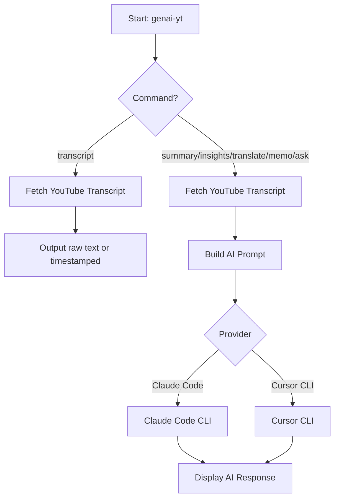

# genai-yt

AI-powered YouTube transcript extractor and analyzer using Claude Code or Cursor CLI.

[](https://www.npmjs.com/package/genai-yt)
[](https://opensource.org/licenses/MIT)
[](https://github.com/Seungwoo321/genai-yt)

## Features

- **Transcript extraction** - Extract raw transcripts from YouTube videos
- **AI-powered analysis** - Summarize, extract insights, translate, or take notes using AI
- **Multi-provider support** - Claude Code CLI and Cursor CLI
- **Custom prompts** - Ask any question about a video with `ask` command
- **Multi-language** - Specify transcript language and translation target

## How It Works



## Prerequisites

- [GitHub CLI](https://cli.github.com/) is NOT required for this tool.
- For AI commands, you need at least one of:
  - [Claude Code CLI](https://docs.anthropic.com/en/docs/claude-code) - Anthropic's official CLI
  - [Cursor Agent CLI](https://www.cursor.com/) - Cursor's agent CLI (command: `agent`)

## Installation

```bash
# Global installation
npm install -g genai-yt

# Or use directly with npx (no installation required)
npx genai-yt transcript <url>
```

## Usage

### Extract Transcript (No AI)

```bash
# Raw transcript text
genai-yt transcript <url>

# With timestamps
genai-yt transcript <url> --timestamps

# Specify language
genai-yt transcript <url> --lang ko
```

### AI-Powered Commands

All AI commands require `-p, --provider` option.

```bash
# Summarize a video
genai-yt summary <url> -p claude-code

# Extract key insights
genai-yt insights <url> -p cursor-cli

# Translate transcript
genai-yt translate <url> -p claude-code --lang en

# Convert to organized notes
genai-yt memo <url> -p claude-code

# Ask a custom question
genai-yt ask <url> -p claude-code --prompt "Extract all investment advice from this video"
```

### Common Options

```bash
# Specify AI model
genai-yt summary <url> -p cursor-cli --model claude-4.5-sonnet

# Specify transcript language
genai-yt summary <url> -p claude-code --transcript-lang ja
```

## Commands

| Command | Description | AI Required |
|---------|-------------|-------------|
| `transcript <url>` | Extract raw transcript | No |
| `summary <url>` | Summarize video content | Yes |
| `insights <url>` | Extract key insights and action items | Yes |
| `translate <url>` | Translate transcript to target language | Yes |
| `memo <url>` | Convert to organized notes | Yes |
| `ask <url>` | Custom prompt-based analysis | Yes |

## Options

### transcript

| Option | Description | Default |
|--------|-------------|---------|
| `--lang <lang>` | Transcript language (e.g., ko, en, ja) | auto |
| `--timestamps` | Include timestamps | `false` |

### AI Commands (summary, insights, translate, memo, ask)

| Option | Description | Default |
|--------|-------------|---------|
| `-p, --provider <provider>` | AI provider (claude-code or cursor-cli) | required |
| `--model <model>` | Model to use | provider default |
| `--transcript-lang <lang>` | Transcript language | auto |

### translate (additional)

| Option | Description | Default |
|--------|-------------|---------|
| `--lang <lang>` | Target language | `en` |

### ask (additional)

| Option | Description | Default |
|--------|-------------|---------|
| `--prompt <prompt>` | Custom prompt | required |

## Examples

```bash
# Get Korean transcript with timestamps
genai-yt transcript https://youtu.be/dQw4w9WgXcQ --lang ko --timestamps

# Summarize a tech talk
genai-yt summary https://www.youtube.com/watch?v=VIDEO_ID -p claude-code

# Translate Japanese video to English
genai-yt translate https://youtu.be/VIDEO_ID -p claude-code --transcript-lang ja --lang en

# Extract investment tips
genai-yt ask https://youtu.be/VIDEO_ID -p cursor-cli --prompt "List all actionable investment tips"
```

## Requirements

- Node.js >= 18.0.0
- Claude Code CLI or Cursor CLI installed and authenticated (for AI commands)

## License

MIT
